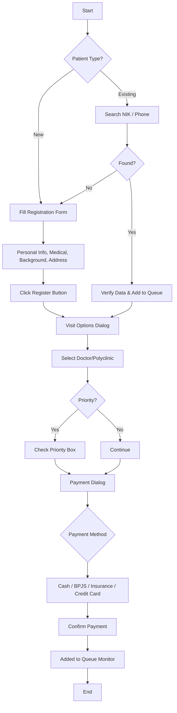
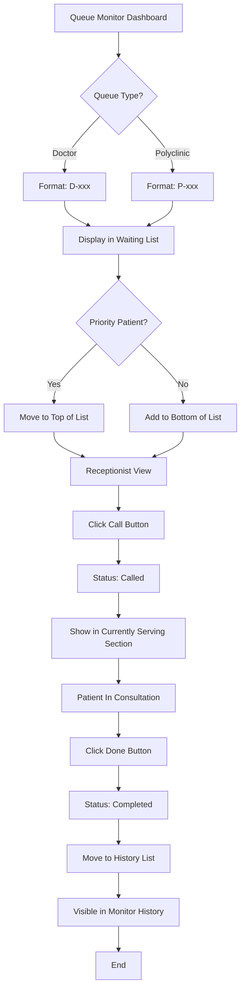
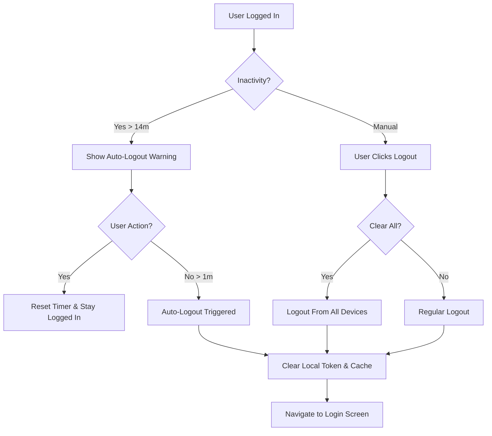
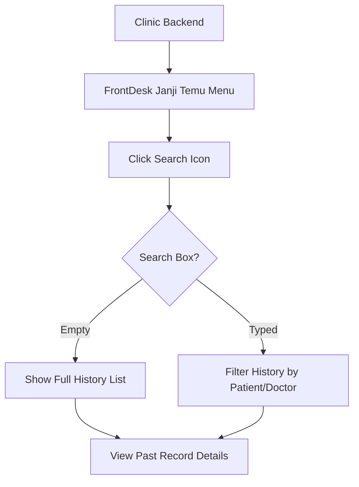
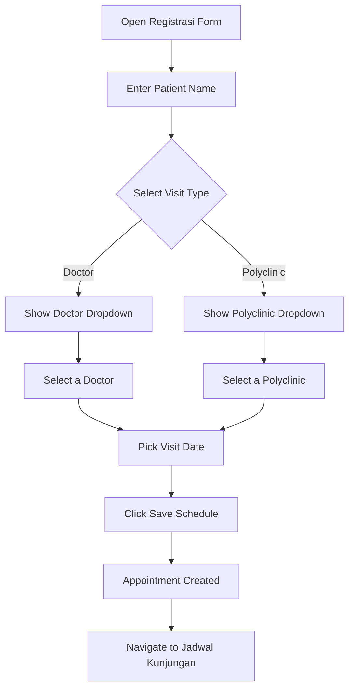
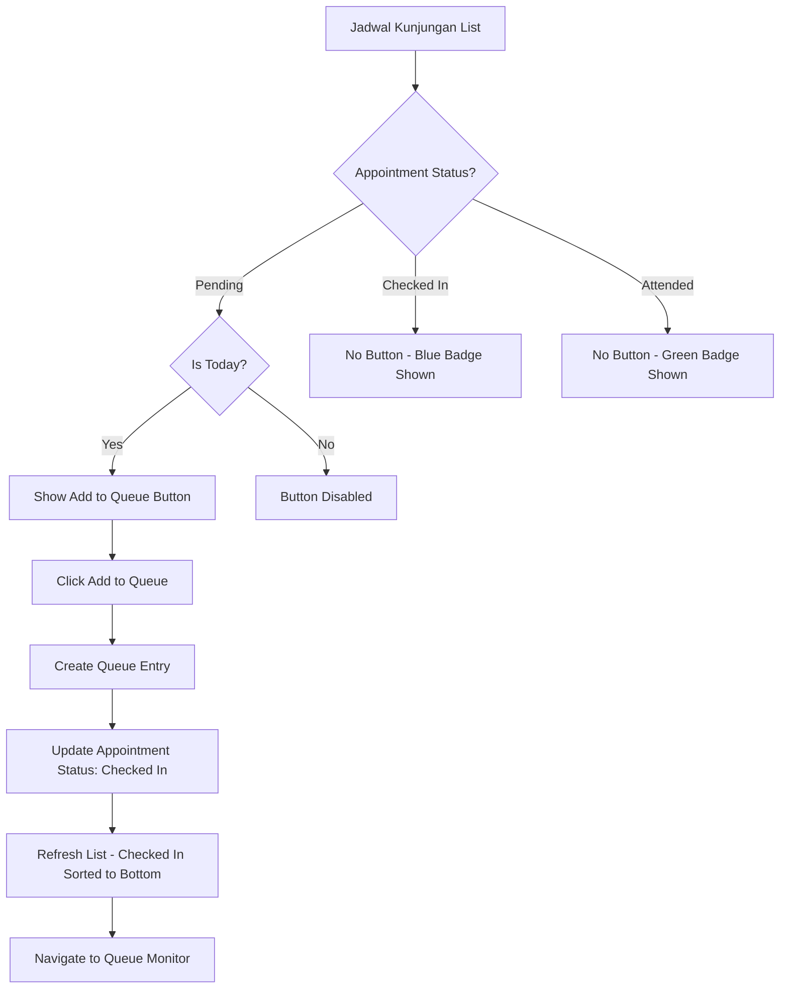

# User Flows: FrontDesk Module

This document visualizes the user journeys for the FrontDesk module.

## 1. Patient Registration Flow

## 2. Queue Monitoring Flow

## 3. Session Security & Logout Flow

## 4. Janji Temu History Search

## 5. Appointment Registration Flow (Doctor or Polyclinic)

## 6. Add to Queue from Appointment Flow

