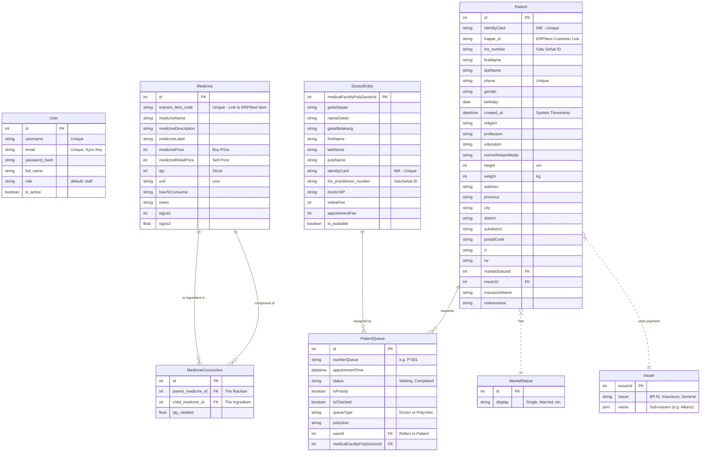

# Entity Relationship Diagram (ERD) - Klinik Admin
**Version:** 2.3 (Matches `backend/models.py`)

```mermaid
erDiagram

    %% Users (Staff/Admin)
    User {
        int id PK
        string username "Unique"
        string email "Unique, Sync Key"
        string password_hash
        string full_name
        string role "default: staff"
        boolean is_active
    }

    %% Master Data: Marital Status
    MaritalStatus {
        int id PK
        string display "Single, Married, etc."
    }

    %% Master Data: Issuer (Insurance/Payment)
    Issuer {
        int issuerId PK
        string issuer "BPJS, Insurance, General"
        json nama "Sub-issuers (e.g. Allianz)"
    }

    %% Master Data: Doctors
    DoctorEntity {
        int medicalFacilityPolyDoctorId PK
        string gelarDepan
        string namaDokter
        string gelarBelakang
        string firstName
        string lastName
        string polyName
        string identityCard "NIK - Unique"
        string ihs_practitioner_number "SatuSehat ID"
        string doctorSIP
        int onlineFee
        int appointmentFee
        boolean is_available
    }

    %% Core: Medicine
    Medicine {
        int id PK
        string erpnext_item_code "Unique - Link to ERPNext Item"
        string medicineName
        string medicineDescription
        string medicineLabel
        int medicinePrice "Buy Price"
        int medicineRetailPrice "Sell Price"
        int qty "Stock"
        string unit "uom"
        string howToConsume
        string notes
        int signa1
        float signa2
    }

    %% Core: Medicine Concoction (Racikan)
    MedicineConcoction {
        int id PK
        int parent_medicine_id FK "The Racikan"
        int child_medicine_id FK "The Ingredient"
        float qty_needed
    }

    %% Core: Patient
    Patient {
        int id PK
        string identityCard "NIK - Unique"
        string frappe_id "ERPNext Customer Link"
        string ihs_number "Satu Sehat ID"
        string firstName
        string lastName
        string phone "Unique"
        string gender
        date birthday
        datetime created_at "System Timestamp"
        string religion
        string profession
        string education
        string nomorRekamMedis
        int height "cm"
        int weight "kg"
        string address
        string province
        string city
        string district
        string subdistrict
        string postalCode
        string rt
        string rw
        int maritalStatusId FK
        int issuerId FK
        string insuranceName
        string noAssuransi
    }

    %% Core: Queue
    PatientQueue {
        int id PK
        string numberQueue "e.g. P-001"
        datetime appointmentTime
        string status "Waiting, Completed"
        boolean isPriority
        boolean isChecked
        string queueType "Doctor or Polyclinic"
        string polyclinic
        int userId FK "Refers to Patient"
        int medicalFacilityPolyDoctorId FK
    }

    %% Relationships
    Patient }|..|| MaritalStatus : "has"
    Patient }|..|| Issuer : "uses payment"
    Patient ||--o{ PatientQueue : "requests"
    DoctorEntity ||--o{ PatientQueue : "assigned to"
    Medicine ||--o{ MedicineConcoction : "composed of"
    Medicine ||--o{ MedicineConcoction : "is ingredient in"

```
