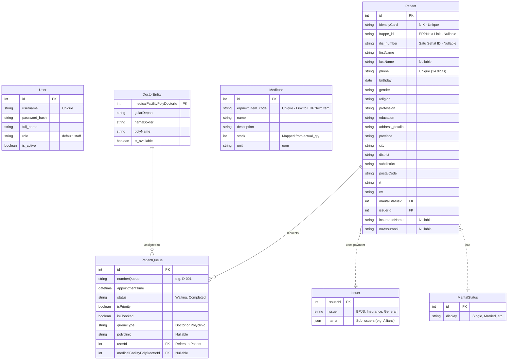

# Entity Relationship Diagram (ERD) - Klinik Admin

```mermaid
erDiagram

    %% Users (Staff/Admin)
    User {
        int id PK
        string username "Unique"
        string password_hash
        string full_name
        string role "default: staff"
        boolean is_active
    }

    %% Master Data: Marital Status
    MaritalStatus {
        int id PK
        string display "Single, Married, etc."
    }

    %% Master Data: Issuer (Insurance/Payment)
    Issuer {
        int issuerId PK
        string issuer "BPJS, Insurance, General"
        json nama "Sub-issuers (e.g. Allianz)"
    }

    %% Master Data: Doctors
    DoctorEntity {
        int medicalFacilityPolyDoctorId PK
        string gelarDepan
        string namaDokter
        string polyName
        boolean is_available
    }

    %% Core: Medicine
    Medicine {
        int id PK
        string erpnext_item_code "Unique - Link to ERPNext Item"
        string name
        string description
        int stock "Mapped from actual_qty"
        string unit "uom"
    }

    %% Core: Patient
    Patient {
        int id PK
        string identityCard "NIK - Unique"
        string frappe_id "ERPNext Link - Nullable"
        string ihs_number "Satu Sehat ID - Nullable"
        string firstName
        string lastName "Nullable"
        string phone "Unique (14 digits)"
        date birthday
        string gender
        string religion
        string profession
        string education
        string address_details
        string province
        string city
        string district
        string subdistrict
        string postalCode
        string rt
        string rw
        int maritalStatusId FK
        int issuerId FK
        string insuranceName "Nullable"
        string noAssuransi "Nullable"
    }

    %% Core: Queue
    PatientQueue {
        int id PK
        string numberQueue "e.g. D-001"
        datetime appointmentTime
        string status "Waiting, Completed"
        boolean isPriority
        boolean isChecked
        string queueType "Doctor or Polyclinic"
        string polyclinic "Nullable"
        int userId FK "Refers to Patient"
        int medicalFacilityPolyDoctorId FK "Nullable"
    }

    %% Relationships
    Patient }|..|| MaritalStatus : "has"
    Patient }|..|| Issuer : "uses payment"
    Patient ||--o{ PatientQueue : "requests"
    DoctorEntity ||--o{ PatientQueue : "assigned to"

```
