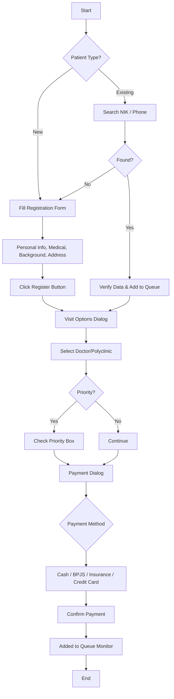
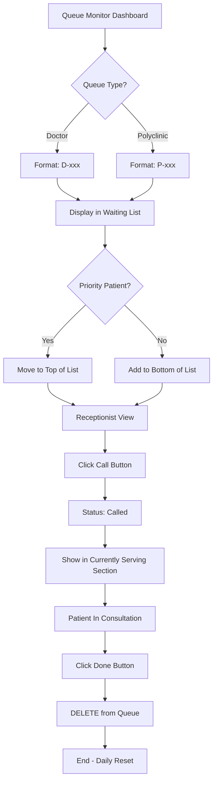
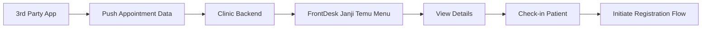

# User Flows: FrontDesk Module

This document visualizes the user journeys for the FrontDesk module.

## 1. Patient Registration Flow

## 2. Queue Monitoring Flow

## 3. Janji Temu (3rd Party Integration) Flow

